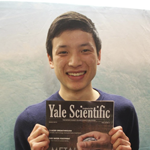
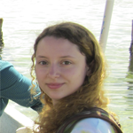

<link rel="stylesheet" href="css/bootstrap.form.css">

Demos, an undergraduate volunteer organization at [Yale University](http://www.yale.edu/) 
in [New Haven, Connecticut](http://www.cityofnewhaven.com/), is dedicated to educating local
elementary students in the basic sciences while showing that science is both fun
and accessible. We have a [long history](/demos/about/) in the New Haven and
Yale communities and are proud to be one of Yale's most respected educational
organizations.  We offer a wide variety of [programs](/demos/programs/). In
fact, during the late '80s and early '90s local school standards did not mandate
that science be taught in elementary schools, and so for nearly a decade,
thousands of New Haven elementary students were only exposed to science through
Demos.

<!--- Carousel slide of pictures -->

Sign up to learn more!
----------------------

<form action="//forms.brace.io/jason.liu@yale.edu" role="form" method="POST">
  

    <label for="name">What's your name?</label>
    <input type="text" name="name" class="form-control" required>
  

  

    <label for="_replyto">And email address?</label>
    <input type="email" name="_replyto" class="form-control" required>
  

  

    <label for="funding">Which program are you interested in?</label>
    <select name="program" class="form-control">
      <option value="">Choose...</option>
      <option>Weekly Classroom Program</option>
      <option>Assemblies</option>
      <option>StarLab</option>
    </select>
  

  

    <input type="hidden" name="_next" value="//jasonkliu.github.io/demos/thanks/">
    <input type="submit" class="btn btn-lg" value="Thanks for submitting!">
  

</form>

Staff
-----

<link rel="stylesheet" type="text/css" href="./css/overlay.css" />

    

        

            

                eric chen  
                 co-coordinator
            

        

        

            

                rain tsong  
                 co-coordinator
            

        

        

            

                christina de fontnouvelle  
                 school coordinator
            

        

        

            

                alice zhang  
                 school coordinator
            

        

    

    

        

            

                tanya shi  
                 school coordinator
            

        

        

            

                wendy yang  
                 school coordinator
            

        

        

            

                maria quinonez  
                 school coordinator
            

        

        

            

                anika binner  
                 assembly coordinator
            

        

    

    

        

            

                nicole tsai  
                 assembly coordinator
            

        

        

            

                jason liu  
                 outreach coordinator 
            

        

        

            

                david minoli  
                 starlab coordinator
            

        

    

    

        

            

                kathleen yu  
                 starlab coordinator
            

        

        

            

                haodong xu  
                 operations coordinator
            

        

    

Questions?
----------
Contact our co-coordinators, [Eric Chen](mailto:demos@dwighthall.org?subject=[DEMOS] Question)
and [Rain Tsong](mailto:demos@dwighthall.org?subject=[DEMOS] Question). 

